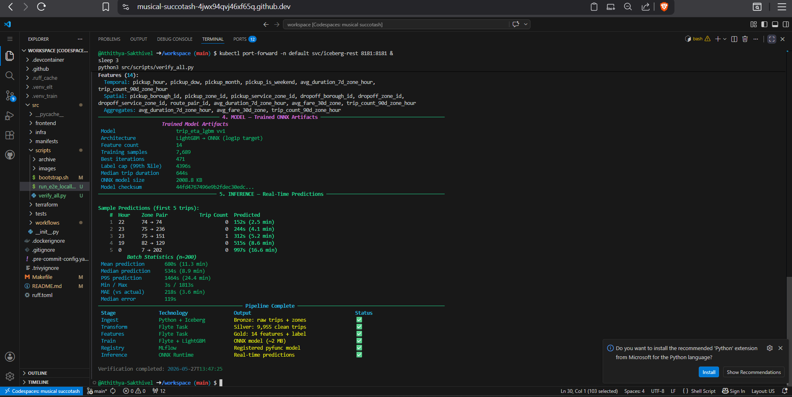

# DataOps-tabular: A contract-driven medallion lakehouse platform

**Contract-driven batch ELT, governed feature engineering, reproducible ML training, and versioned ONNX model packaging — orchestrated by Flyte, computed by Spark, stored on Iceberg/S3, and served via MLflow.**

---

## What This Solves

Most ML projects fail in production because of three missing guarantees:

1. **No data lineage** — cannot trace which raw data produced which model
2. **Feature drift** — training features differ from serving features
3. **Unreproducible models** — cannot rebuild the exact same model from source

DataOps-tabular eliminates all three by enforcing **contracts at every stage**:

- **Schema contracts** — Gold tables define the exact feature order and types; training reads, never re-derives
- **Lineage contracts** — Every row traces back to its source file, revision, and ingestion run
- **Bundle contracts** — Models ship with checksum-verified metadata, schema, and manifest files
- **Resource contracts** — Flyte tasks declare explicit CPU/memory budgets, enforced by Kubernetes

---

## Architecture

```
HuggingFace → Bronze (raw + lineage) → Silver (clean + valid) → Gold (frozen features + contract)
                                                                        │
                                                                        ▼
                                                              Training (LightGBM)
                                                                        │
                                                                        ▼
                                                              ONNX bundle (checksum-verified)
                                                                        │
                                                                        ▼
                                                              MLflow (metrics + pyfunc model)
```

**Bronze** — Raw source data with minimal normalization. Every row carries `run_id`, `source_uri`, `source_revision`, and `ingestion_ts`.

**Silver** — Canonical trip records. Deduplicated via SHA-256 trip IDs. Enriched with temporal features, zone lookups, and validated ranges.

**Gold** — Frozen feature matrix. 14 model features with point-in-time-safe aggregates. A companion contract table records the exact schema hash, encoding maps, and aggregate definitions — creating an immutable serving contract.

**Training** — LightGBM regressor with log1p target transform. Searches 7 hyperparameter candidates, selects best by capped MAE, exports to ONNX with parity checks.

**Evaluation** — Downloads the published bundle, validates all checksums, computes holdout metrics, logs everything to MLflow, and registers a PyFunc wrapper.

---

## Key Results

| Metric | Baseline | Model | Improvement |
|--------|----------|-------|-------------|
| MAE (seconds) | 428 | 311 | **27.4%** |
| Median Error | — | 113s (1.9 min) | — |
| Training samples | — | 7,689 | — |
| Features | — | 14 | — |
| ONNX bundle size | — | 2 MB | — |

---

## Prerequisites

Create a GitHub Codespace and wait for the `postCreateCommand` to complete after the bootstrap script finishes.

## Quick Start

Creates a temporary S3 bucket, provisions a local Kubernetes cluster, runs the full ELT + training pipeline, and prints a verification summary:

```sh
export AWS_ACCESS_KEY_ID=<your-access-key>
export AWS_SECRET_ACCESS_KEY=<your-secret-key>
export AWS_DEFAULT_REGION=ap-south-1
bash src/scripts/run_e2e_locally.sh
```

This single command:

1. Creates a temporary S3 bucket
2. Spins up Kind (local Kubernetes)
3. Deploys PostgreSQL (CloudNativePG), Iceberg REST catalog, Spark operator, and Flyte
4. Runs the full ELT pipeline (Bronze → Silver → Gold)
5. Trains the LightGBM model and exports a checksum-verified ONNX bundle
6. Registers the model and metrics with MLflow
7. Runs a verification script that loads data from all layers and performs live inference

**Expected output after 30 minutes:**  


---

## Core Design Principles

### Contract-Driven Development
Every stage produces a verifiable artifact. The Gold layer's contract table is the source of truth for feature order, encoding, and aggregates. Training consumes this contract — never re-derives features. This guarantees training-serving parity.

### Immutable Lineage
Every row from Bronze through Gold carries lineage metadata. You can trace any prediction back to the exact source file, code revision, and ingestion run that produced its training data.

### Separation of Concerns
- **ELT** owns data transformation (Spark tasks)
- **Training** owns model building (LightGBM → ONNX)
- **Maintenance** owns Iceberg housekeeping (separate workflow)
- **Orchestration** owns execution order and scheduling (Flyte)

Each domain is independently testable, deployable, and debuggable.

### Reproducibility by Default
- SHA-256 trip IDs for deterministic deduplication
- Iceberg snapshots for time-travel queries
- Checksum-verified ONNX bundles
- All hyperparameters, metrics, and artifacts logged to MLflow

### Validation at Every Boundary
- Bronze validates source schemas before writing
- Silver filters null timestamps, negative fares, zero durations
- Gold validates feature ranges, categorical domains, and label distributions
- Training validates the ELT contract, bundle checksums, and ONNX parity

---

## Model Features

**Temporal (4):** `pickup_hour`, `pickup_dow`, `pickup_month`, `pickup_is_weekend`  
**Spatial (7):** `pickup_borough_id`, `pickup_zone_id`, `pickup_service_zone_id`, `dropoff_borough_id`, `dropoff_zone_id`, `dropoff_service_zone_id`, `route_pair_id` (hashed)  
**Aggregates (3):** `avg_duration_7d_zone_hour`, `avg_fare_30d_zone`, `trip_count_90d_zone_hour`

All aggregates are point-in-time-safe — computed only from data available before each trip's pickup time.

---

## Technology Stack

| Layer | Technology | Purpose |
|-------|-----------|---------|
| Orchestration | Flyte | Workflow scheduling, task isolation, resource enforcement |
| Compute | Spark on Kubernetes | Distributed ELT processing |
| Table format | Apache Iceberg | ACID transactions, snapshots, time travel |
| Object store | S3 | Immutable data and model storage |
| Operational DB | PostgreSQL (CloudNativePG) | Flyte catalog, MLflow backend, Iceberg metadata |
| Training | LightGBM → ONNX | Gradient boosting → portable inference runtime |
| Model registry | MLflow | Experiment tracking, model versioning, PyFunc serving |
---
